_Essa é a documentação do tutorial de criação de um jogo 2D Top-Down Shooter na Engine GameMaker para a Semana de Estudo, Pesquisa e Extensão do Instituto Federal Catarinense Campus Araquari de 2026._

_O projeto usado de exemplo está disponível no repositório do Github desta página._

---

## Sumário

- [Sumário](#sumário)
- [Introdução ao GameMaker](#introdução-ao-gamemaker)
- [Instalação do GameMaker](#instalação-do-gamemaker)
        - [Ubuntu](#ubuntu)
        - [Windows](#windows)
- [Criação do Projeto](#criação-do-projeto)
- [Conhecendo o espaço de trabalho do GameMaker](#conhecendo-o-espaço-de-trabalho-do-gamemaker)
    - [Configuração da plataforma](#configuração-da-plataforma)
    - [Áreas principais](#áreas-principais)
- [Criando os objetos](#criando-os-objetos)
    - [Eventos](#eventos)
    - [Os inputs do player](#os-inputs-do-player)
- [Criando uma Sala](#criando-uma-sala)
- [Criando um Sprite](#criando-um-sprite)
- [Controlando o Player](#controlando-o-player)
    - [Movimento](#movimento)
    - [Colisões](#colisões)
    - [Outras Variáveis](#outras-variáveis)
    - [Atirando](#atirando)
- [Criando um Inimigo](#criando-um-inimigo)
    - [Criando um Path](#criando-um-path)
    - [Criando um Script](#criando-um-script)
    - [Fazendo o Inimigo Atacar](#fazendo-o-inimigo-atacar)
    - [Tela de Game Over e Barra de Vida](#tela-de-game-over-e-barra-de-vida)
- [E Agora?](#e-agora)
    - [Divirta-se!](#divirta-se)
    - [E onde eu posso publicar meu jogo?](#e-onde-eu-posso-publicar-meu-jogo)

---

## Introdução ao GameMaker

Antigamente conhecido como GameMaker Studio 2, a engine GameMaker é uma ferramenta de criação de jogos famosa por sua simplicidade e facilidade de começar a utilizá-la, embora seja relativamente menos poderosa que outras engines como a Unity ou a Godot. Seu foco principal é em jogos 2D, possuindo um certo suporte à gráficos 3D limitados, e sua grande vantagem é a maneira com que ela é realmente perfeita para esse tipo de jogo. Muitos jogos 2D populares e aclamados, especialmente independentes, foram feitos à partir do GameMaker, alguns que posso destacar são:

- [Undertale](https://undertale.com/)/[Deltarune](https://deltarune.com/).
- [Hotline Miami 1 e 2](https://www.hotlinemiami.com/).
- [Forager](https://store.steampowered.com/app/751780/Forager/).
- [Pizza Tower](https://store.steampowered.com/app/2231450/Pizza_Tower/).
- [Katana ZERO](https://katanazero.com/).
- [Hyper Light Drifter](https://store.steampowered.com/app/257850/Hyper_Light_Drifter/).

Além de ser altamente acessível e fácil de se aprender, a engine também oferece um [enorme manual](https://manual.gamemaker.io/monthly/br/##t=Content.htm) em sua página oficial contendo guias de todas as funções e funcionalidades diferentes em vários idiomas, incluindo português brasileiro, que pode muito bem servir de material tanto para desenvolvedores iniciantes quanto experientes.

Eu mesmo tenho alguns jogos na minha página do [itch.io](https://paulok3tchup.itch.io/) que podem servir de exemplo para vocês das capacidades dessa engine até mesmo nas mãos de um desenvolvedor sem muita experiência como eu.

> **Observação:** GameMaker é um software gratuito que permite que você crie e exporte os jogos gratuitamente para algumas plataformas sem problemas, _**ENTRETANTO**_ é necessário **comprar** uma licença para que o jogo possa ser comercializado e exportado para outras plataformas, como Nintendo Switch, Playstation e etc. Para mais informações sobre as licenças do GameMaker, acesse a [página de licenças](https://gamemaker.io/pt-BR/get).

Mas agora, antes de começar o desenvolvimento, precisamos primeiramente instalar o dito cujo.

---

## Instalação do GameMaker

###### Ubuntu

Para Instalar o GameMaker no Ubuntu, basta executar o seguinte comando no terminal:

    curl -L -o gamemaker.deb https://gamemaker.io/pt-BR/download/ubuntu/lts/GameMaker.zip && sudo dpkg -i gamemaker.deb && rm gamemaker.deb

O comando vai a senha da sua conta de usuário, digite-a para prosseguir com a instalação.

> **Explicação dos comandos**:
>
> > - **curl -L -o gamemaker.deb [link]**: Ele baixa o arquivo de instalação do GameMaker com o nome "gamemaker.deb".
> > - **sudo dpkg -i gamemaker.deb**: Ele instala o arquivo de instalação.
> > - **rm gamemaker.deb**: Ele remove o arquivo de instalação.

###### Windows

No Windows, basta acessar a [página de download](https://gamemaker.io/pt-BR/download) do site oficial e selecionar a opção Windows (ou clicando nesse [link direto](https://gms.yoyogames.com/GameMaker-Installer-2026.0.0.16.exe) que eu coloquei aqui) que o arquivo de instalação será baixado. Depois de baixar, basta executar o arquivo para instalar o GameMaker.

> **Observação:** A versão do GameMaker utilizada neste tutorial é a versão **LTS (Long Term Stable)**, que é a versão mais estável e recomendada para desenvolvimento de jogos, não recebe atualizações com frequência, caso queira que a Engine se mantenha atualizada, baixe a versão **padrão** do GameMaker.

---

## Criação do Projeto

Após instalar o GameMaker, abra o programa e clique no botão "New" para criar um novo projeto.

Depois disso, o GameMaker vai perguntar qual será o tipo de projeto, as opções são **"Game"**, **"Live Wallpaper"** e **"Game Strip"**, nós vamos escolher a opção **"Game"**. Quando selecionada, o GameMaker mostra diversos templates de jogos diferentes para experimentar caso queira, mas nesse tutorial nós vamos escolher a opção **"Blank Pixel Game"** para começar. Essa opção cria um projeto quase completamente em branco.

> **Observação:** A diferença entre as opções **"Blank Game"** e **"Blank Pixel Game"** é que a segunda opção já tem as opções de gráficos adaptados para pixel art, caso queira usar gráficos de resolução maior pode usar a primeira opção.

Ao lado dos templates nós temos algumas outras opções para o projeto:

- **Scripting Language**: A linguagem do projeto, o GameMaker tem duas linguagens de script:
  - **GML Code**: A linguagem de script tradicional, semelhante a outras linguagens como Javascript e Python. **Essa que vamos escolher.**
  - **GML Visual**: A linguagem de script visual, onde você pode criar scripts usando blocos visuais, sem precisar escrever código. Usada geralmente para aprender, mas eu pessoalmente não recomendo.
- **Project Name**: O nome do projeto, você pode escolher o nome que quiser para o seu projeto.
- **Location**: O local onde o projeto será salvo, você pode escolher o local que quiser para salvar o seu projeto.

Depois que tudo estiver feito, clique no botão "Let's Go!".

---

## Conhecendo o espaço de trabalho do GameMaker

Seja bem-vindo ao espaço de trabalho do GameMaker!

#### Configuração da plataforma

**ANTES DE TUDO**!!! Se você estiver no **Linux**, clique no ícone de alvo no canto superior direito ta tela, aqui fica as opções de que plataforma você vai selecionar pra rodar o jogo, o padrão é a opção "Testar". Selecione a opção **"GX.games"** para que o jogo rode no navegador. O GameMaker exige muito mais etapas de instalação para rodar nativamente no Linux e muitas delas não são possíveis de serem executadas nos computadores do IFC (ou de qualquer escola que bloqueia acesso ao admin), mas rodar no navegador não exige nenhuma configuração a mais.

Se estiver no **Windows**, pode deixar na opção "Testar" mesmo, que o jogo vai rodar normalmente.

Agora podemos voltar ao espaço de trabalho.

#### Áreas principais

Nessa página inicial nós podemos reparar em quatro coisas principais:

- O Inspetor na esquerda. Ele serve pra configurar o **asset** que esteja atualmente selecionado (ele começa na última sala aberta, nesse caso a única).
- Os Recursos na direita. É aqui que ficam todos os **assets** do projeto.
- As outras opções e configurações acima.
- O Console abaixo (ele começa fechado).

> Além desses quatro também existem várias outras telas como o **Editor de Sprite**, o **Editor de Objetos** e o **Editor de Salas**, mas esses nós ainda vamos conhecer ao longo da aula.

Começaremos pelos recursos.

## Criando os objetos

Como devem ter notado, o GameMaker já cria uma sala inicial pro jogo funcionar. Manteremos essa sala existindo para usá-la futuramente. Agora, clicando com o botão direito no espaço vazio abaixo da sala, vamos criar um **grupo** chamado "Objects", e dentro desse grupo criaremos dois objetos, um chamado "obj_player" e outro chamado "obj_controle".

Clicando duas vezes em um desses objetos vai abrir o **Editor de Objeto**, nessa tela nós podemos mudar o sprite, a máscara de colisão e o mais importante: os **Eventos**! Antes de partirmos para os eventos, entretanto, vamos escolher o _obj_controle_ para começar e vamos marcar a opção "persistente" no editor dele.

#### Eventos

Os eventos controlam quando e como o jogo vai rodar os códigos que foram escritos. Nesse objeto que estamos editando agora, vamos usar dois eventos à princípio:

- Evento **Criar**: Os códigos nesse evento rodam somente uma vez quando o objeto é criado no jogo.
- Evento **Etapa Inicial**: Os códigos nesse evento rodam em todos os frames do jogo, mas **antes** do evento **Etapa\***.

> \*O GameMaker possui três variações do evento etapa:
>
> - Etapa Inicial: Roda antes do etapa.
> - Etapa: Roda "no meio".
> - Etapa Final: Roda após o etapa.
>
> Todos esses eventos ainda rodam a todos os frames do jogo, mas é importante aprender a ordem deles.

Esse objeto servirá de controle para certas variáveis que devem existir a todo momento no jogo, e vamos começar pelas mais importantes:

#### Os inputs do player

Pro jogo realmente funcionar como um jogo nós devemos ser capazes de controlar os menus e os personagens, então abriremos o evento **Criar** e vamos escrever o seguinte código:

    //Create

    global.btn_cima = false
    global.btn_baixo = false
    global.btn_esq = false
    global.btn_dir = false

> Variáveis com prefixo "global." são acessíveis por todos os objetos e scripts do jogo.

Esse vai ser o código básico de controle direcional. Mas ele não vai funcionar ainda, até por que ele está false em todos os botões, então vamos fazer esse código funcionar no evento **Etapa Inicial**:

    //Begin Step

    global.btn_cima = keyboard_check(ord("W"))
    global.btn_baixo = keyboard_check(ord("S"))
    global.btn_esq = keyboard_check(ord("A"))
    global.btn_dir = keyboard_check(ord("D"))

> **"keyboard_check"** é uma função que lê o input da tecla que foi dada de parâmetro e retorna true enquanto ele estiver sendo segurado. Essa função tem algumas variações como o **"keyboard_check_pressed"** e o **"keyboard_check_released"** que retornam true em contextos diferentes e outras.
>
> **"ord()"** é uma função que recebe um caractere e retorna seu valor Unicode (UTF8). Isso é necessário para que o GameMaker leia as letras do teclado.

Agora o jogo está lendo o input nas teclas W, A, S e D e associando eles à variáveis de botão pra cima, esquerda, baixo e direita respectivamente. E agora, já que estamos usando o **keyboard_check** na **Etapa Inicial**, o jogo vai saber se essas teclas estão sendo pressionadas antes de executar qualquer coisa que esteja no evento **Etapa** de qualquer outro objeto!

Mas não adiante ter os controles e não ter o que controlar, então vamos entrar no **obj_player** e adicionar os seguintes eventos:

- Criar.
- Etapa.

No evento Criar, por enquanto, vamos definir somente a velocidade dele:

    //Create

    spd = 3

> Observação: A coordenada (0,0) numa sala do GameMaker fica no canto superior esquerdo e seu limite fica no canto inferior direito, logo:
>
> - Movimentos "positivos" levam o player para a direita e para baixo
> - Movimentos "negativos" levam o player para a esquerda e para cima

Agora vamos ao evento Etapa e, só para testes, vamos só fazer ele se mexer sem controle nenhum:

    //Step

    x += spd
    y += spd

> Usaremos movimentos positivos aqui como devem ter notado pelo fato de que a posição do player é somada com a velocidade. Isso deve fazer o player deslizar na diagonal para direita e para baixo.

É uma boa maneira de saber se a velocidade dele está boa antes de aplicar o controle.
Então vamos descobrir! Clique no botão com símbolo de _play_ ou aperte F5 para rodar o jogo e você verá algo lindo:

**Absolutamente Nada!**

Pois é, o jogo não vai funcionar antes de nós configurarmos pelo menos uma **sala** no jogo, e é isso que faremos agora!

## Criando uma Sala

Vamos usar aquela mesma sala que o GameMaker já criou para nós, mas vamos fazer duas coisas antes: criar uma pasta chamada **"Rooms"** e renomar essa sala para **"rm_teste"**.

Agora, clicando duas vezes nessa sala, vamos abrir o **Editor de Sala**.

Aqui, todo o esquema fica no **Inspetor**.

Acima nós temos as camadas, abaixo nós temos as configurações da sala num todo.

Sendo bem direto no que faremos aqui:

- Mudaremos a altura e largura da sala para 1000x1000.
- Na sessão "Visores e Câmeras" vamos:
  - Marcar a opção "Ativar Visor".
  - Abrir o Visor 0 e marcar a opção "Visível".
  - Vamos mudar o tamanho do visor e da câmera para 640x480.
  - Mudar o "Objeto seguido" para o obj_player, a borda vertical para 240 e a borda horizontal para 320.
- Colocaremos o obj_player na camada "Instances".
- Adicionaremos uma camada de instâncias chamada "Hud" e colocaremos o obj_controle nessa camada.

> **Explicação**: Visores e câmeras são usados para controlar o que o jogador vê na tela, o visor determina **que** parte da sala é exibida, enquanto a câmera determina **como** essa parte da tela é exibida, e essa exibição é chamada e "Visão" ou "View". As mudanças que fizemos no tamanho do visor e da câmera é para que nosso jogo tenha a resolução de 640x480 e a determinação do objeto seguido é para que a câmera siga o player. Caso você queira que a câmera se aproxime ou se afaste do player, mude o valor da **câmera**, não do visor!

Não vamos mexer nas físicas da sala hoje, pois vamos simular nossa própria física simples.

Agora, antes de darmos F5, precisamos dar uma **aparência** ao nosso obj_player para que ele fique visível na tela.

## Criando um Sprite

Na aba de recursos, vamos criar um novo grupo chamado "Sprites" e dentro desse grupo vamos criar um sprite chamado "spr_player".

> **Imagem:** Estrutura completa até agora!

Clicando duas vezes nesse sprite, vamos abrir o **Editor de Sprite**.

Aqui, nós podemos criar a aparência do nosso player e mexer em suas propriedades. Podemos clicar no botão "Editar Imagem" para abrir o editor de imagens ou clicar em "Importar" para importar uma imagem existente. Vamos mudar o tamanho do sprite pra 32x32 e clicar em "Editar Imagem".

O editor é bem simples, trate-se de um programa de desenho embutido com ferramentas básicas. Por enquanto, vamos desenhar apenas um retângulo colorido para representar o jogador.

Retornando ao editor de sprite, vamos mudar a origem do sprite para o centro clicando no dropdown do canto superior esquerdo. Isso siginifica que qualquer movimento, rotação e outras coisas de movimento vão ser calculados a partir do centro do sprite, e não da borda superior esquerda, que é o padrão.

> **Dica Extra**: No editor de sprite também temos algumas outras opções importantes, como as de textura e o nine slice, mas uma que eu destaco é a **Máscara de colisão**, pois nela você pode definir o tamanho e posição da "hitbox" do sprite.

Agora vamos clicar duas vezes no obj_player para abrir o editor de objetos e vamos mudar o sprite do player para o spr_player que acabamos de criar.

> **Observação:** Como deve ter reparado existe uma opção de "Máscara de colisão" logo abaixo da definição do sprite, essa opção serve para que o objeto tenha uma hitbox diferente do sprite original dele.

Agora nós podemos dar F5 e ver nosso obj_player se movendo maravilhosamente!

Entretando, o movimento dele ainda não é controlável, então vamos apagar esse código de etapa que escrevemos e vamos começar do zero.

## Controlando o Player

#### Movimento

Agora nós vamos voltar ao evento Etapa do nosso obj_player e vamos pensar um pouco no seguinte:

Esse código aqui é funcional:

    //Step

    if global.btn_cima {
        y -= spd
    }
    if global.btn_baixo {
        y += spd
    }
    if global.btn_esq {
        x -= spd
    }
    if global.btn_dir {
        x += spd
    }

Mas ele é muito redundante e pode ser chato de alterar no futuro, então vamos bolar uma abordagem diferente.

Uma variável no estado **false** é igual a 0 no código, enquanto o **true** é igual a 1.

Apesar de usarmos esses termos booleanos, o GameMaker (assim como todas as outras linguagens) lê essas variáveis como números mesmo, e assim pode-se fazer operações matemáticas com eles como qualquer outro número.
Consequentemente, podemos chegar na seguinte conclusão:

    //Subtraímos o lado "negativo" do lado "positivo" do movimento
    global.btn_dir - global.btn_esq

    //Se nenhum botão for apertado:
    global.btn_dir - global.btn_esq = 0

    //Se o botão esquerdo for apertado:
    global.btn_dir - global.btn_esq = -1

    //Se o botão direito for apertado:
    global.btn_dir - global.btn_esq = 1

Como podem ver, o resultado da subtração entre o lado positivo e o negativo traz um resultado que condiz com o lado do movimento no jogo (Negativo pra esquerda, Positivo pra direita) e então podemos fazer com que o código seja simplesmente assim:

    //Step

    var hsp = (global.btn_dir - global.btn_esq)*spd
    var vsp = (global.btn_baixo - global.btn_cima)*spd

    x += hsp
    y += vsp

> **Explicação do código**:
>
> > - **var**: é usado para declarar uma variável local, só usada dentro do escopo que foi declarada. Nesse caso, criamos a variável **"hsp"**.
> > - <strong>(global.btn_dir - global.btn_esq)\*spd</strong>: o resultado da subtração é multiplicado pela velocidade.
> > - **x += hsp**: somamos o hsp à coordenada **x** do player.

Apertando F5, o jogo permanece o mesmo visualmente, mas agora o player se move de acordo com os inputs do teclado!

Entretanto, o player não possui limites, barreiras, nada que o impeça de sair andando pra fora da sala, e isso não é algo que queremos, então vamos adicionar uma coisa **muito** importante.

#### Colisões

Criaremos um obj_parede, ele não precisa de código nenhum, por enquanto ele será visível e terá um sprite de cor bem diferente do player.

> Lembre-se de manter a origem do sprite no **centro**!

Agora, vamos criar uma camada "Collisions" e colocar algumas instâncias desse objeto na sala, aqui vocês podem mexer no tamanho e posição dessas instâncias, só não recomendo mexer no ângulo por enquanto.

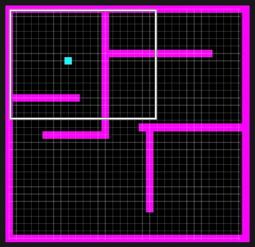

Entretanto, nem adianta dar F5 pra testar pois ainda não fizemos o código da colisão.

Voltando ao evento etapa do obj_player, substitua esse código:

    x += hsp
    y += vsp

Por esse:

    if place_meeting(x + hsp, y, obj_parede) {
      while (!place_meeting(x + sign(hsp),y,obj_parede)) {
        x += sign(hsp)
      }
      hsp = 0
    }
    x += hsp

    if place_meeting(x, y + vsp, obj_parede) {
      while (!place_meeting(x,y + sign(vsp),obj_parede)) {
        y += sign(vsp)
      }
      vsp = 0
    }
    y += vsp

> **Explicação:**
>
> - **if place_meeting(...)**: Verifica se o player está em colisão com a parede.
> - **loop while**: Faz uma verificação extra pixel por pixel pra garantir que o player esteja, de fato, colidindo com a parede.
> - **hsp = 0 (ou o vsp = 0)**: Zera a velocidade para que o player pare.
> - **x += hsp (ou o y += vsp)**: Aplica a velocidade à posição do player.
>
> **Observação:** É recomendável que mantenha essas duas estruturas lógicas **separadas** para evitar conflitos na colisão horizontal e vertical.

Apertando o F5 e rodando o jogo, agora nós podemos ver nosso obj_player se mexendo pela tela e colidindo com as paredes colocadas!

#### Outras Variáveis

Agora que o movimento base do nosso player está pronto, vamos começar a montar a jogabilidade desse jogo de verdade. Nosso jogo será um **top-down shooter!**

O primeiro passo é definir algumas variáveis importantes no evento **Criar** do nosso obj_player:

    //Create Event

    spd = 3 //Vamos manter essa aqui igual

    //Agora adicionamos essas:

    vida_max = 100
    vida = vida_max

    dano = 3

    delay_max = 10
    delay = delay_max

> **Explicação:**
>
> - **vida_max e vida**: Definem a vida do player.
> - **dano**: Define o dano que o tiro do player vai causar ao inimigo.
> - **delay_max e delay**: Definem o intervalo entre os tiros do player.
>
> **Como vai funcionar o tiro:** O player terá um tiro padrão com um dano e intervalos definidos, no futuro, se quiser, você pode adicionar itens/armas que mudam esses valores.

Agora vamos voltar ao obj_controle rapidinho e vamos adicionar isso no evento Criar:

    global.btn_tiro = false

E isso no Etapa Inicial:

    global.btn_tiro = mouse_check_button(mb_left)

> **Explicação:**
>
> - **mouse_check_button(...)**: Lê o clique de algum botão do mouse de maneira contínua, enquanto estiver segurado ela será **true**, se soltar será **false**.
> - **mb_left**: Especifica que é o botão esquerdo, poderia ser **mb_right**, **mb_middle** ou outros botões que o mouse pode ter.
>
> Assim, nós definimos qual será o botão utilizado para atirar no jogo.

Agora vamos criar dois objetos simples: A mira e o próprio tiro.

#### Atirando

O objeto da mira vai ser bem simples, vamos só criar um obj_mira e um sprite bonitinho pra ela:

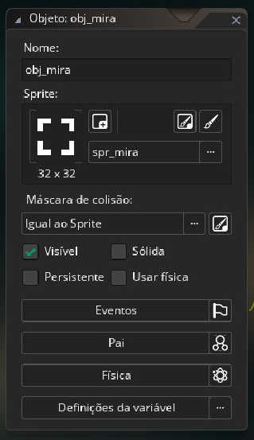

Depois vamos no evento **Etapa Final** e adicionamos esse código:

    x = mouse_x
    y = mouse_y

> **Explicação:**
>
> - **x = mouse_x (e o mesmo pro y)**: Lê a posição do mouse na tela e define a posição do objeto com base nela.
> - **Etapa Final**: Essa é a versão do etapa que ocorre depois da etapa padrão, usamos ela aqui para garantir que o objeto sempre esteja na posição do mouse, pois o movimento do mouse é calculado durante a **Etapa** padrão.

E agora só adicionamos esse objeto na camada "Hud" em qualquer lugar da sala.

Mas antes de rodar o jogo, vamos criar o obj_tiro e um sprite bonito pra ele.

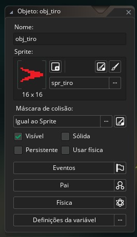

> **Detalhe:** Quando desenhar esse sprite, garanta que ele esteja apontado para a direita!!!

E vamos no evento Criar dele:

    spd = 5

E no evento Etapa:

    speed = spd
    image_angle = direction

> **Explicação:**
>
> **Speed** é uma variável embutida do GameMaker que define o movimento de um objeto por etapa do jogo usando a outra variável embutida **direction** que define a direção desse movimento. O **image_angle** aqui só deixa o ângulo do sprite igual à variável direction.

Diferente do obj_mira, esse aqui não será colocado manualmente na sala.

Vamos voltar ao evento Etapa do obj_player e adicionar o seguinte:

    //Step Event

    if delay > 0 delay--

    delay = clamp(delay,0,delay_max)

    var ang = point_direction(x,y,obj_mira.x,obj_mira.y)

    if delay <= 0 && global.btn_tiro {
        delay = delay_max
        var _tiro = instance_create_layer(x,y,"Instances",obj_tiro)
        _tiro.direction = ang
    }

> **Explicação:**
>
> - **if delay > 0 delay--**: Diminui o valor do delay a cada etapa para que ele sempre volte ao 0.
> - **delay = clamp(delay,0,delay_max)**: Mantém o valor do delay entre 0 e delay_max.
> - **var ang = point_direction(x,y,obj_mira.x,obj_mira.y)**: Calcula a direção do tiro em relação à mira.
> - **if delay <= 0 && global.btn_tiro**: Verifica se o delay chegou a 0 e se o botão de tiro está pressionado.
> - **var \_tiro = instance_create_layer(x,y,"Instances",obj_tiro)**: Cria uma instância do objeto tiro na posição do player e coloca essa instância numa variável local \_tiro.
> - **\_tiro.direction = ang**: Aplica o cálculo de direção do tiro na instância \_tiro.

Agora podemos apertar F5 e ver o player atirando na direção da mira, mas ainda não temos inimigos para testar o dano do tiro, e o tiro está atravessando as paredes, então vamos corrigir isso.

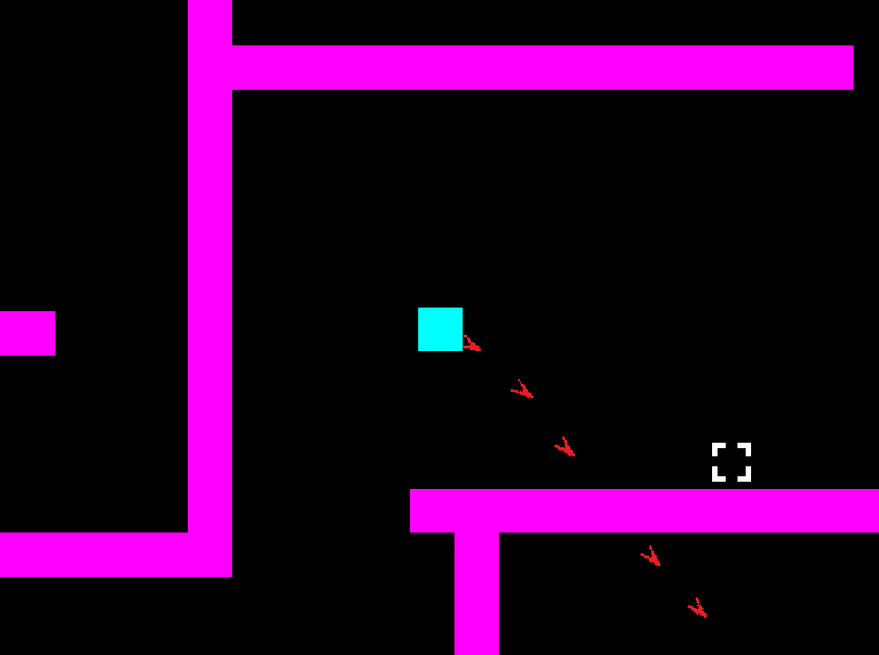

Primeiro vamos consertar o tiro atravessando as paredes, então vamos adicionar o seguinte código no evento **Etapa** do obj_tiro:

    if place_meeting(x,y,obj_parede) {
        instance_destroy()
    }

E também vamos adicionar o instance_destroy() no evento **Ambiente Externo** do obj_tiro:

    instance_destroy()

Isso garante que o tiro seja destruído caso ele saia da sala ou colida com uma parede.

E que tal se adicionarmos um efeito pra quando o tiro é destruído? Vamos criar um obj_explosao e um sprite pra ele, que vai ser uma animação de explosão.

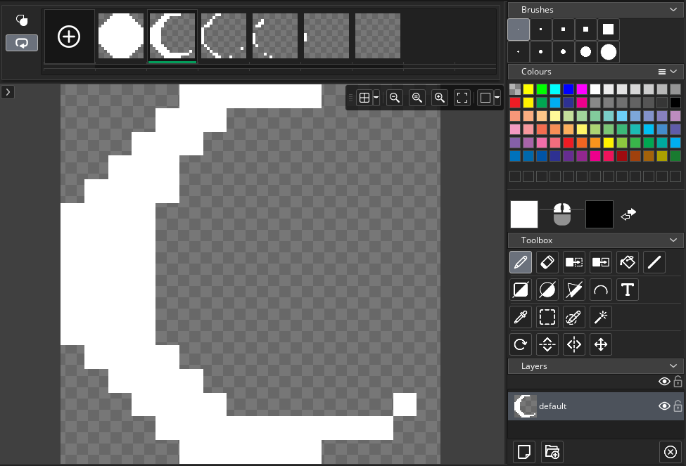

No editor de sprite nós podemos adicionar mais frames para a animação, nesse caso vamos fazer 6 frames de uma pequena explosão se dissipando.

Vamos aplicar esse sprite no obj_explosao.

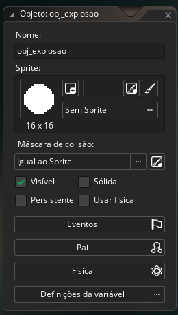

Agora, no evento Etapa do obj_explosao, vamos adicionar o seguinte código:

    if (image_index+image_speed >= image_number){
        instance_destroy()
    }

Esse é um simples código que destrói a instância depois que a animação termina, e agora vamos adicionar o seguinte código no evento **Destruir** do **obj_tiro**:

    instance_create_layer(x,y,"Instances",obj_explosao)

Assim, ele vai criar uma pequena explosão toda vez que for destruído.

> **Observação:** O evento **Destruir** é chamado toda vez que a instância do objeto é destruída, seja por colisão, ambiente externo ou qualquer outro motivo.
>
> **Observação 2:** O evento **Ambiente Externo** é chamado toda vez que a instância do objeto sai da sala, seja por colisão, ambiente externo ou qualquer outro motivo.
>
> **Observação 3:** O código aplicado no evento **Etapa** do obj_explosao funciona pra qualquer animação, então é só mudar o sprite do obj_explosao caso precise de uma animação diferente e o código vai funcionar do mesmo jeito.

Agora podemos fazer um inimigo simples para testar o dano do tiro e a vida do player.

## Criando um Inimigo

#### Criando um Path

Normalmente um inimigo teria uma IA mais complexa que monta um caminho inteiro até o player, mas nesse caso vamos fazer um inimigo mais simples que seque um caminho predefinido e ataca o player quando ele estiver próximo.

Assim como fizemos antes com os objetos, vamos criar um objeto chamado **obj_inimigo** e um sprite para ele, que vai ser um quadrado vermelho simples.

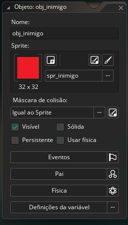

Mas, antes de escrevermos qualquer código, vamos voltar para o editor de sala.

Vamos criar uma camada do tipo **Path** chamada **Paths** e depois vamos criar um grupo chamado **Paths** e um caminho chamado **pth_inimigo**.

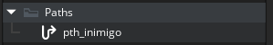

Agora, na camada Paths, vamos arrastar o pth_inimigo para a sala e vamos configurar dessa maneira:

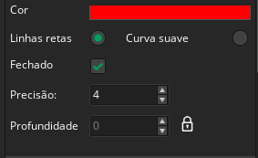

Assim o caminho vai ficar reto e vai ser um loop, e o inimigo vai andar nesse caminho indefinidamente.

> **Observação:** Se quiser, pode marcar a opção **Curva Suave**, ela faz com que o movimento fique mais suave e natural pela sala. Nesse caso em específico eu vou deixar desmarcado para que o inimigo se mova de maneira mais "robótica".

Agora é só desenhar o caminho pela sala. Como nós marcamos a opção "Fechado", não precisamos nos preocupar em fechar o caminho, ele vai se fechar sozinho.

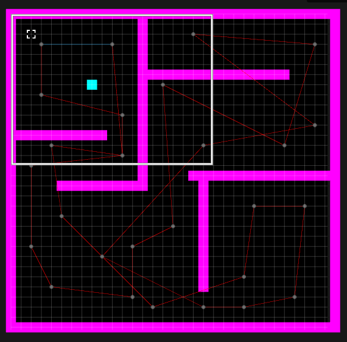

Agora, vamos no evento **Criar** do obj_inimigo e adicionar o seguinte código:

    //Create Event

    vida_max = 30
    vida = vida_max

    dano = 5

    speed = 5

    path_start(pth_inimigo, speed, path_action_restart, true)

> **Explicação:** **path_start():** Função que faz o objeto seguir o caminho definido no primeiro parâmetro, os outros parâmetros definem a velocidade, o que fazer quando o caminho acaba e se ele vai ser relativo à posição (false) ou absoluto no mapa (true).

E vamos colocar o objeto na camada "Instances" da sala, em qualquer lugar da sala, pois ele vai seguir o caminho que desenhamos do primeiro ponto colocado.

Agora vamos criar uma coisa interessante: Um **script**.

#### Criando um Script

Scrips são códigos que podem ser chamados de qualquer lugar do jogo, e eles podem receber parâmetros para serem usados dentro do código. Eles são muito úteis para evitar a repetição de código e para organizar melhor o projeto.

Crie a pasta "Scripts" e dentro dela crie um script chamado **scr_dano**.

Dentro dele, vamos escrever o seguinte código:

    function scr_dano(_dano,_obj){
        _obj.vida -= _dano
    }

Ele é super simples, só aplica o dano passado como parâmetro na vida do objeto passado como parâmetro, mas será útil para aplicarmos o dano no inimigo e no player de maneira mais organizada.

No evento etapa do obj_inimigo, vamos adicionar o seguinte código:

    if place_meeting(x,y,obj_tiro) {
        var _tiro = instance_place(x,y,obj_tiro)
        scr_dano(_tiro.dano,id)
        instance_destroy(_tiro)
    }
    if vida <= 0 instance_destroy()

> **Explicação:**
>
> - **if place_meeting(x,y,obj_tiro)**: Checa se o objeto está em colisão com o tiro;
> - **var \_tiro = instance_place(x,y,obj_tiro)**: Caso esteja, armazena esse obj_tiro numa variável local \_tiro;
> - **scr_dano(\_tiro.dano,id)**: Aplica o dano desse obj_tiro em si mesmo;
> - **instance_destroy(\_tiro)**: Destroy esse objeto armazenado;
> - **if vida <= 0 instance_destroy()**: Se a vida for menor ou igual a 0, o objeto é destruído.

Apertando F5, agora podemos atirar no inimigo e-

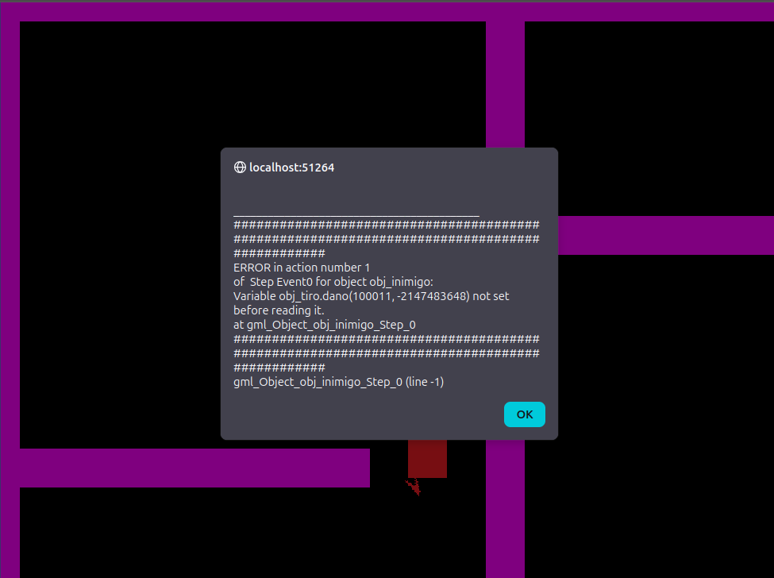

**Oops!**

Parece que esquecemos de passar o valor do dano para o obj_tiro! Vamos fazer isso agora.

No evento Criar do obj_tiro, vamos adicionar o seguinte código:

    dano = 0

E no código de atirar do obj_player, vamos mudar a linha que cria o tiro para:

    var _tiro = instance_create_layer(x,y,"Instances",obj_tiro)
    _tiro.direction = ang
    _tiro.dano = dano

Agora o obj_tiro vai dar o dano definido no obj_player, o inimigo vai perder vida quando for atingido e ser destruído quando a vida chegar a 0.

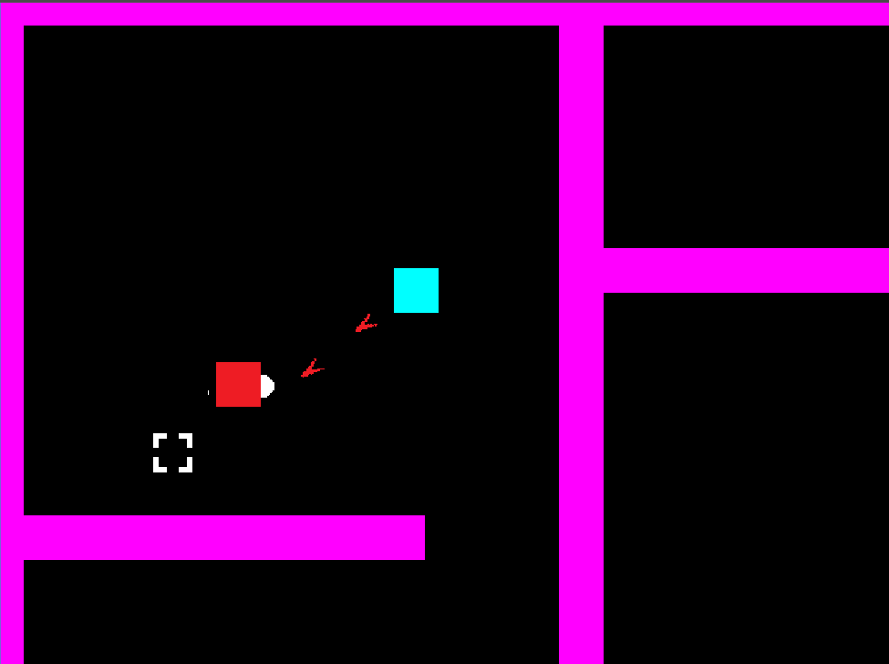

E que tal se reusarmos o obj_explosao no inimigo? Vamos criar um novo sprite chamado spr_explosao_inimigo, dessa vez ele será maior.

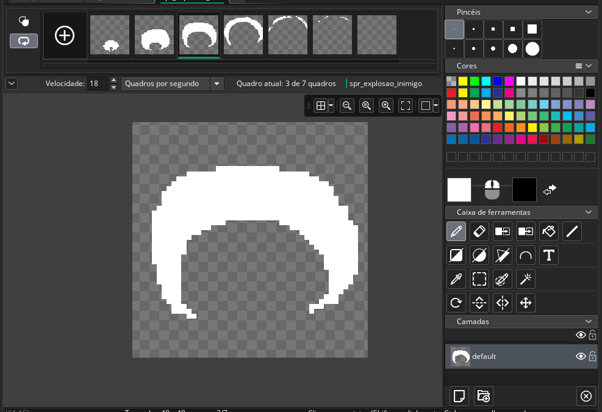

E no evento **Destruir** do obj_inimigo, vamos adicionar o seguinte código:

    var _explosao = instance_create_layer(x,y,"Instances",obj_explosao)
    _explosao.sprite_index = spr_explosao_inimigo

> **Explicação:**
>
> - **var \_explosao = instance_create_layer(...)**: Cria uma instância do obj_explosao na posição do inimigo e armazena numa variável local \_explosao;
> - **\_explosao.sprite_index = spr_explosao_inimigo**: Muda o sprite da instância criada para o spr_explosao_inimigo

Agora podemos apertar F5 e ver o inimigo sendo destruído com uma explosão maior quando sua vida chega a 0!

#### Fazendo o Inimigo Atacar

Agora precisamos fazer com que o inimigo ataque o player quando estiver próximo, para isso vamos criar um objeto chamado **obj_tiro_inimigo** e colocar um sprite de ataque diferente do nosso.

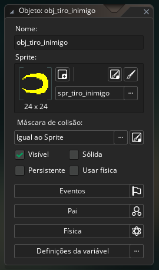

O código dele será igual o do **obj_tiro** por enquanto, mas com uma velocidade maior, vamos colocar **12**. Inclusive, vamos tirar essa oportunidade para aumentar a velocidade do tiro do player para **7**.

Agora, no evento **Criar** do obj_inimigo, vamos adicionar o seguinte código:

    delay_max = 20
    delay = delay_max

E no evento **Etapa** vamos colocar isso:

    if delay > 0 delay--
    delay = clamp(delay,0,delay_max)

    var ang = point_direction(x,y,obj_player.x,obj_player.y)

    if delay <= 0 && distance_to_object(obj_player) < 200 {
        delay = delay_max
        var _tiro = instance_create_layer(x,y,"Instances",obj_tiro_inimigo)
        _tiro.direction = ang
        _tiro.dano = dano
    }

> **Explicação:** Esse código é semelhante ao código de tiro do player, mas ao invés de calcular o ângulo em relação à mira, ele calcula em relação ao player. Além disso, ele só atira se o player estiver a menos de 200 pixels de distância (a função distance_to_object() faz isso).

E agora, vamos fazer o player receber dano. No evento **Etapa** do obj_player, vamos adicionar o seguinte código:

    if place_meeting(x,y,obj_tiro_inimigo) {
        var _tiro = instance_place(x,y,obj_tiro_inimigo)
        scr_dano(_tiro.dano,id)
        instance_destroy(_tiro)
    }
    if vida <= 0 {
        morto = true
    }

Mas antes de rodar, vamos adicionar no evento **Criar** do obj_player a variável **morto**:

    morto = false

E logo no começo do evento **Etapa**, vamos adicionar o seguinte código:

    if morto exit

> **Explicação:** Se a variável "morto" for verdadeira, o código do evento Etapa não vai rodar, assim o player não vai se mover nem atirar.

#### Tela de Game Over e Barra de Vida

Entretanto, você deve ter notando que quando o player morre, ele simplesmente para de se mover e atirar, mas não há nenhuma indicação visual de que ele morreu (e nem uma maneira de reiniciar o jogo), e isso não é algo que queremos.

Então, por fim, vamos resolver esses problemas criando um objeto chamado **obj_hud**, ele não precisa ter sprite.

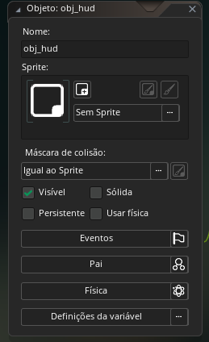

Esse objeto será colocado na camada "Hud" da sala e vai ser responsável por mostrar a vida do player na tela e também mostrar a tela de _game over_ quando o player morrer.

Vamos começar pela tela de game over, no evento **Desenhar** do obj_hud, vamos adicionar o seguinte código:

    var _x_meio = camera_get_view_x(view_camera) + camera_get_view_width(view_camera)/2
    var _y_meio = camera_get_view_y(view_camera) + camera_get_view_height(view_camera)/2

    draw_set_valign(fa_center)
    draw_set_halign(fa_middle)

    if obj_player.morto {
        draw_set_alpha(0.8)
        draw_rectangle_colour(0,0,room_width,room_height,c_black,c_black,c_black,c_black,false)
    	draw_set_alpha(1)
        
    	draw_text_colour(_x_meio,_y_meio,"GAME OVER",c_red,c_red,c_red,c_red,1)
    }

> **Explicação:**
>
> - **\_x_meio e \_y_meio**: Calculam o centro da câmera para desenhar o texto no meio da tela.
> - **draw_set_valign(fa_center) e draw_set_halign(fa_middle)**: Configuram o alinhamento do texto para o centro.
> - **if obj_player.morto**: Verifica se o player está morto.
> - **draw_set_alpha(0.8)**: Define a transparência para desenhar o retângulo de fundo.
> - **draw_rectangle_colour(...)**: Desenha um retângulo preto cobrindo toda a tela.
> - **draw_set_alpha(1)**: Restaura a transparência para desenhar o texto.
> - **draw_text_colour(...)**: Desenha o texto "GAME OVER" no centro da tela com a cor vermelha.

> **Observação:** Normalmente se recomenda usar **Desenhar GUI** para desenhar elementos da interface do usuário, mas nesse caso estamos usando o evento **Desenhar** pois notei certos problemas desenhando na GUI usando o GXGames, pelo menos nos PCs do IFC.

Também vamos no evento Etapa do obj_hud e adicionar o seguinte código:

    if obj_player.morto && keyboard_check_pressed(ord("R")) {
        room_restart()
    }

> **Explicação:** Se o player estiver morto e a tecla "R" for pressionada, o jogo vai reiniciar a sala atual.

Nossa telinha de game over ficou assim:

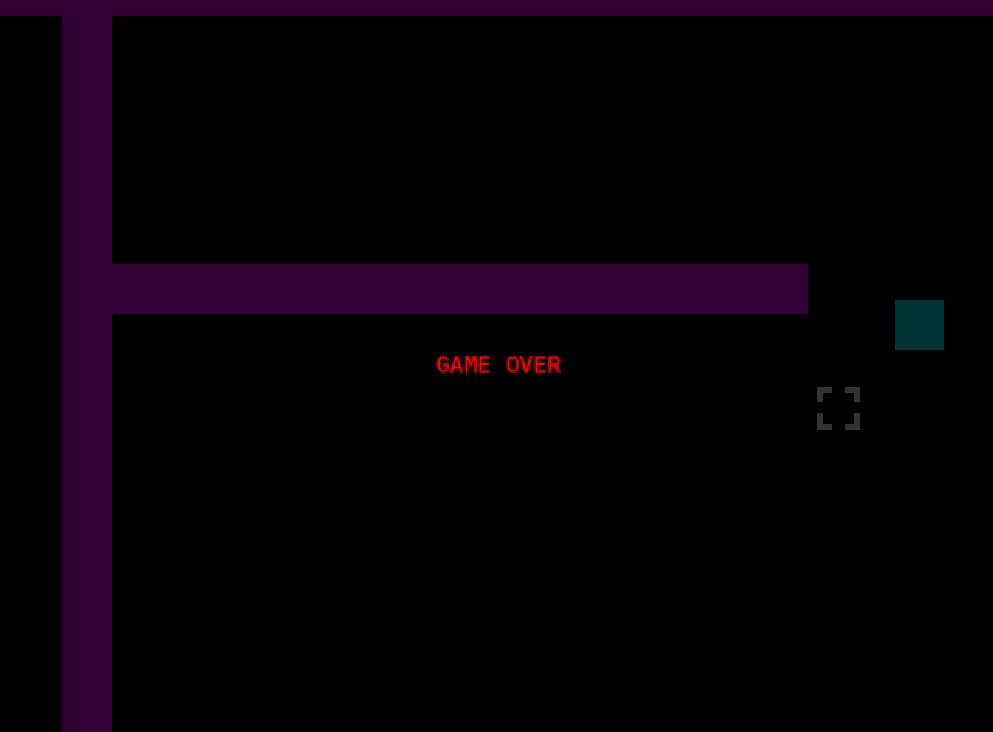

Agora vamos fazer uma barra de vida simples sobre o player para ver quanto de vida nós temos restante durante o jogo.

No evento **Desenhar** do obj_hud, vamos adicionar o seguinte código:

    if obj_player.morto {
        // Código de antes
    } else {
        var _vida_porcentagem = obj_player.vida / obj_player.vida_max
        var _vida_largura = 100
        var _vida_altura = 10
        var _vida_x = obj_player.x - _vida_largura/2
        var _vida_y = obj_player.y - 40

        draw_set_alpha(0.5)
        draw_rectangle_colour(_vida_x,_vida_y,_vida_x+_vida_largura,_vida_y+_vida_altura,c_black,c_black,c_black,c_black,false)
        draw_set_alpha(1)

        draw_rectangle_colour(_vida_x,_vida_y,_vida_x+_vida_largura*_vida_porcentagem,_vida_y+_vida_altura,c_green,c_green,c_green,c_green,false)
    }

> **Explicação:** De modo resumido, esse código calcula a porcentagem de vida restante do player e desenha uma barra de vida verde sobre ele, com um fundo preto semi-transparente, mas somente enquanto o player estiver vivo.

E ela vai ficar bem assim:

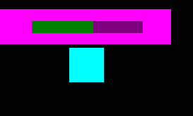

## E Agora?

#### Divirta-se!

Agora você pode customizar esse jogo do jeito que quiser! Pode adicionar uma barra de vida ao inimigo, adicionar mais inimigos, criar outras fases, powerups, chefões e etc. Crie novos sprites mais bonitinhos ou procure sprites na internet (mas não publique nada que não é seu sem permissão!). O céu é o limite!

Recomendo, novamente, visitar o [manual](https://manual.gamemaker.io/monthly/br/##t=Content.htm) oficial do GameMaker para aprender mais sobre as funções e eventos disponíveis, ou procurar tutoriais na internet para aprender outros métodos de trazer seu jogo à vida.

Se quiser você pode até baixar o projeto completo que eu fiz como exemplo [aqui no repositório desse tutorial](https://github.com/PauloK3tchup/tutorial-gamemaker-sepe.git) para adaptar ele a seu gosto.

Outra recomendação e o canal do [YouTube](https://www.youtube.com/@GameMakerEngine) do próprio GameMaker, que possui vários tutoriais e dicas de como usar a engine.

#### E onde eu posso publicar meu jogo?

Imagino que, logo de cara, você deve estar pensando e publicar seu jogo numa plataforma como a Steam ou a Epic Games Store (acho difícil alguém querer publicar na Epic, mas enfim), mas antes de pensar nisso, você deveria primeiro tentar publicar seu jogo em plataformas mais simples e gratuitas como o [Itch.io](https://itch.io/) ou o [Game Jolt](https://gamejolt.com/).

Essas plataformas são mais simples e rápidas de publicar, e você pode receber feedbacks da comunidade para melhorar seu jogo antes de tentar publicar em plataformas maiores, além de que essas plataformas também são cheias de jogos independentes para você experimentar e se inspirar antes de começar o seu.

Uma coisa muito importante se ter em mente é que **a parte mais difícil de fazer um jogo é COMEÇAR!** Não tenha medo de mergulhar de cabeça nesse assunto se é algo que te interessa mesmo que pareça impossível.

Uma dica de ouro que eu posso dar é a seguinte: Não comece com seu "projeto dos sonhos", comece pequeno, faça um jogo simples ou até tente recriar algum jogo que você gosta, e depois vá aumentando a complexidade do seu projeto aos poucos. O importante é começar e ir aprendendo com os erros e acertos.
